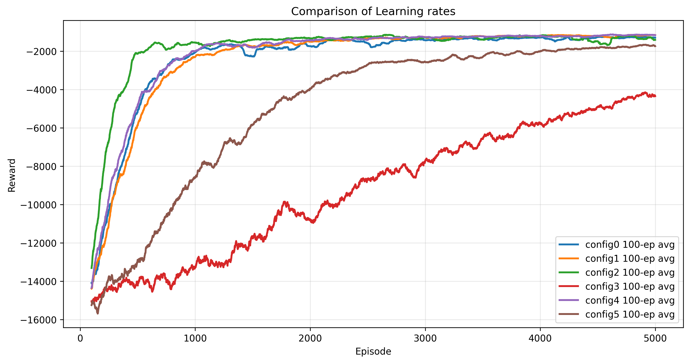
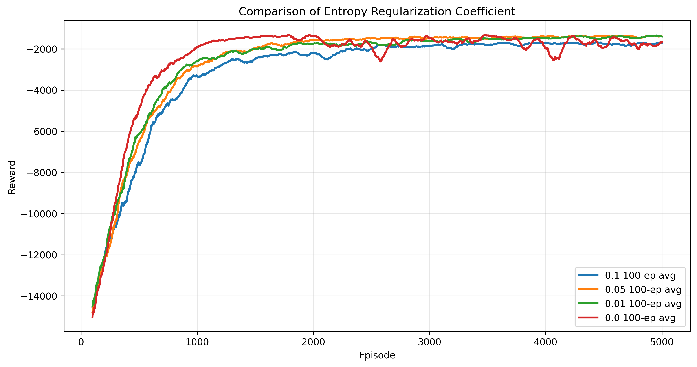
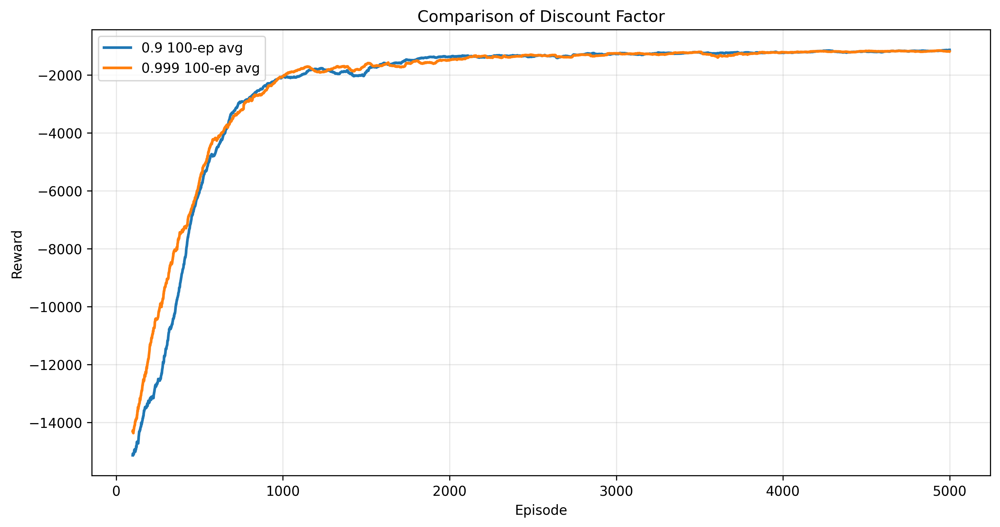

# Solving Energy Efficient Multi-UAV Coverage Control Problem by Multi-Agent Reinforcement Learning Based Approach

## Description
This project addresses the coverage control problem for multiple unmanned aerial vehicles (UAVs) using a multi-agent reinforcement learning (MARL) approach. The problem is formulated within a game-theoretic framework and solved using an Independent Advantage Actor with Centralized Critic (IA2CC) algorithm. Validation and evaluation include hyperparameter tuning, reward function analysis, and generalization testing of the trained models.

## Table of Content
1. Problem Formulation
2. Environment and Algorithm Implementation
3. Validation and Evaluation Results

## 1. Problem Formulation

The problem is formulated using the **Decentralized Partially Observable Markov Decision Process (Dec-POMDP)** framework.  
Dec-POMDP is an extension of the standard Markov Decision Process (MDP) to multi-agent scenarios and offers:

- **Partial Observability**  
  Each UAV operates with limited local information about the environment.  

- **Decentralized Decision-Making**  
  UAVs make decisions independently, without relying on centralized control.  

- **Cooperative Behavior**  
  A shared global reward function trains agents to coordinate and complete tasks collectively.  

This formulation closely reflects real-world scenarios, such as a team of UAVs performing area coverage with only local observations and no direct inter-agent communication.

## 2. Environment and Algorithm Implementation

### Environment

The file **`IA2CC/environment.py`** models the environment dynamics and simulates interactions among multiple UAVs within a **discrete 2D grid world**.  
It also handles **reward calculation** and adheres to the **OpenAI Gym API** design principles, ensuring compatibility and ease of experimentation.

Key features include:

- **`env.reset()`**  
  Resets the environment to its initial state, enabling a fresh start for each training episode.

- **`env.step(actions)`**  
  Executes a single step in the environment based on the **collection of actions** chosen by all UAVs, returning the next state, reward, and other relevant information.

This modular design facilitates smooth integration with reinforcement learning algorithms and accelerates development and testing.

### Algorithm

The **IA2CC** algorithm is an extension of the **Advantage Actor-Critic (A2C)** framework, designed specifically for **multi-agent scenarios**.  
It adopts the widely used **Centralized Training with Decentralized Execution (CTDE)** paradigm, where agents are trained with access to global information but operate independently using only local observations during execution.

The file **`IA2CC/IA2CC.py`**,  **`IA2CC/Actor.py`**,  **`IA2CC/Critic.py`** implements the core components of the algorithm.

- **`Actor` Class (`Actor.py`)**  
  Defines the **actor network** responsible for policy learning.  
  Implemented using **PyTorch**, it is a **feedforward neural network** consisting of three fully connected layers,with **ReLU** activation functions applied to each hidden layer to introduce non-linearity and improve learning performance.

- **`Critic` Class (`Critic.py`)**  
  Defines the **centralized critic network** used for value estimation.  
  Similarly implemented in **PyTorch**, it is a **feedforward neural network** with three fully connected layers,each hidden layer utilizing **ReLU** activation functions for effective representation learning.

- **`IA2CC` Class (`IA2CC.py`)**  
  Encapsulates the **model initialization**, including both the **actor** and **critic** networks.  
For flexibility and fine-tuning, it accepts configurable parameters such as:

  - Actor input and output sizes  
  - Critic input size  
  - Number of agents  
  - Learning rates  
  - Discount factor  
  - Entropy weight  

  This class is carefully designed with **scalability, modularity, and reusability** in mind,  
making it adaptable for various multi-agent reinforcement learning setups.  

- **`IA2CC/learner.py`**  
  Contains the **`train()`** function, which implements the **step-by-step logic of the training loop**, including interaction with the environment, experience collection, loss computation, and network updates.

## 3. Validation and Evaluation Results

### Hyperparameter Tuning

The following parameters were tuned during training:  
1. Learning Rate  
2. Entropy Coefficient  
3. Discount Factor  

#### Learning Rate

In IA2CC, the actor and critic networks each have their own independent learning rates.  
Six different learning rate configurations were evaluated over **5000 training episodes**, each consisting of **100 steps**:

| Configuration # | Actor Learning Rate | Critic Learning Rate |
|-----------------|--------------------|---------------------|
| 1               | 0.0001             | 0.0001              |
| 2               | 0.0001             | 0.0003              |
| 3               | 0.0003             | 0.0001              |
| 4               | 0.00001            | 0.0001              |
| 5               | 0.0001             | 0.001               |
| 6               | 0.00003            | 0.0003              |

<b>Figure 1:</b> Reward trend during training under different learning rate configurations, showing how varying actor and critic learning rates impact convergence and performance.

#### Entropy Coefficient

The **entropy coefficient** controls the strength of entropy regularization, which encourages exploration and helps prevent premature convergence to suboptimal policies. The following entropy coefficient values were tested to analyze their effect on exploration and policy convergence:

| Configuration # | Entropy Coefficient |
|-----------------|---------------------|
| 1               | 0.00                |
| 2               | 0.01                |
| 3               | 0.05                |
| 4               | 0.10                |

<b>Figure 2:</b> Reward trend during training under different entropy weights, demonstrating 0.05 and 0.01 achieved desirable performance over 0.1 and 0.0.

#### Discount Factor

The **discount factor** determines the extent to which future rewards are considered during return calculation and ranges between 0 and 1. The larger value corresponds to long-term rewards which align with the objective of the problem. Thus, two large values of discount factor were tested:

| Configuration # | Discount Factor     |
|-----------------|---------------------|
| 1               | 0.900               |
| 2               | 0.999               |

<b>Figure 3:</b> Reward trend during training with different discount factors. 
While both settings exhibit stable learning behavior, a discount factor of 0.999 promotes longer-term planning and fosters earlier cooperation among the UAVs.

### Reward Function Validation

The reward function consists of three main components:  
- **Total Area Gained** (positive reward)  
- **Overlap Penalty** (negative reward)  
- **Energy Penalty** (negative reward)  

To analyze the impact of the energy constraint, two controlled experiments were conducted:  
1. With a high energy penalty weight in the reward function  
2. Without any energy penalty (energy weight set to zero)  

This comparison highlights how incorporating energy considerations influences agent behavior and overall performance.

| Metric                         | Configuration 1 | Configuration 2 |
|--------------------------------|-----------------|-----------------|
| Average Energy                 | 1347.36         | 1687.24         |
| Standard Deviation of Energy   | 27.15           | 13.98           |
| Average Coverage (%)           | 98.20           | 98.92           |
| Standard Deviation of Coverage | 1.80            | 1.32            |
| Highest Energy                 | 1416.00         | 1726.00         |
| Lowest Energy                  | 1286.00         | 1650.00         |

The results indicate that without the energy constraint, UAVs tend to explore the environment more randomly without achieving significant improvements in area coverage.
In contrast, incorporating an energy penalty encourages more efficient movement patterns that balance energy consumption while maintaining a nearly identical average coverage rate.

### Generalization Testing

Configuration 1 and Configuration 2 from the Reward Function Validation section were evaluated on 50 unseen random seeds, achieving coverage rates of 97% and 99%, respectively.

However, when tested on an unfamiliar environment (a larger 50×50 grid), both configurations only achieved approximately 50% coverage, indicating that the models tend to overfit to the original training environment (30×30 grid) and fail to generalize effectively to larger or different environments.

Possible reasons for this limited generalization include:

- Limited domain randomization during training, restricting exposure to diverse scenarios

- Architectural design of the centralized critic, which may constrain the model’s ability to dynamically adapt to varying environments

### Illustration
<video width="600" controls>
  <source src="IA2CC/evaluate_30x30/seed_42/rewardweight/config1/trajectory.mp4" type="video/mp4">
  Your browser does not support the video tag.
</video>

  Training demonstration video showing UAVs coordination in action (30x30 grid).

<video width="600" controls>
  <source src="IA2CC/evaluate_50x50/evaluate(150 steps)/seed_0/rewardweight/config1/trajectory.mp4" type="video/mp4">
  Your browser does not support the video tag.
</video>

  Training demonstration video showing UAVs coordination in action (50x50 grid).

### Acknowledgement

I would like to express my sincere gratitude to my supervisor, Dr. Leonardo Stella, for his continuous support and guidance throughout this project.  
Additionally, I extend my thanks to Alan Binu for his valuable assistance and insightful suggestions that helped me take the necessary steps toward successful completion.
